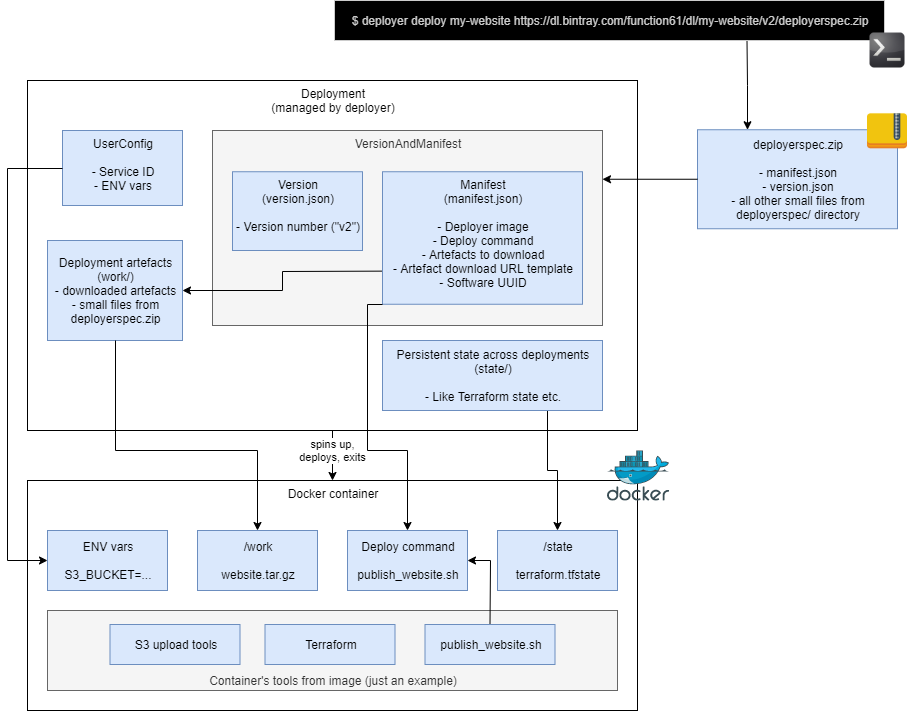

Deploy anything with this container-based deployment tool. It supports using different
container images to contain the deployment tooling.

Use cases:

- Deploy static website
- Deploy AWS Lambda function + required permissions/config + API gateway with help of Terraform
- Anything else where each version of your project has files that you want to put somewhere

Architecture
------------

Example project using Deployer
------------------------------

See example project, [Onni](https://github.com/function61/onni), using Deployer (it also has
instructions).

How does it work?
-----------------

Basically, deploying anything is downloading a `deployerspec.zip`. The minimum it contains:

- manifest.json
  * Tells which Docker image and a command inside it to use to do the deployment itself
  * Tells which build artefacts to download from the version
- version.json

Basically, the `deployerspec.zip` tells **how to do the deployment**, but doesn't contain
the  files to deploy. `deployerspec.zip` is same as `deployerspec/` directory but with
build-time generated `version.json` added.

In Onni's case [this directory](https://github.com/function61/onni/tree/master/deployerspec)
is zipped at build-time and uploaded as a build
artefact to Bintray which is downloadable at `https://dl.bintray.com/function61/dl/onni/$version/deployerspec.zip`.

Therefore when you run `$ deployer deploy onni https://url/to/the.zip`, it will download &
unzip to read the
[manifest.json](https://github.com/function61/onni/blob/master/deployerspec/manifest.json)
to find out which `deployer_image` to use, ask you about user-specific deployment settings
(like API credentials), inject them and finally hand off the dirty work to the container.

In Onni's case the container image contains [Terraform](https://www.terraform.io/) which
ultimately takes care of the heavy lifting to call all the relevant AWS APIs.

Alternatives
------------

- [CNAB](https://cnab.io/)?
